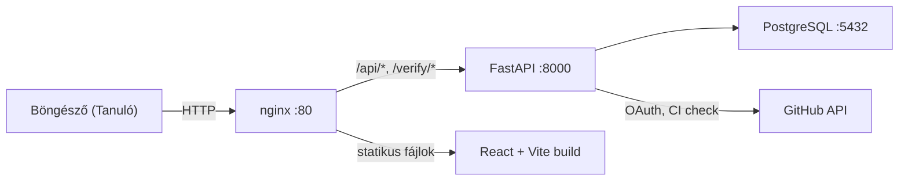
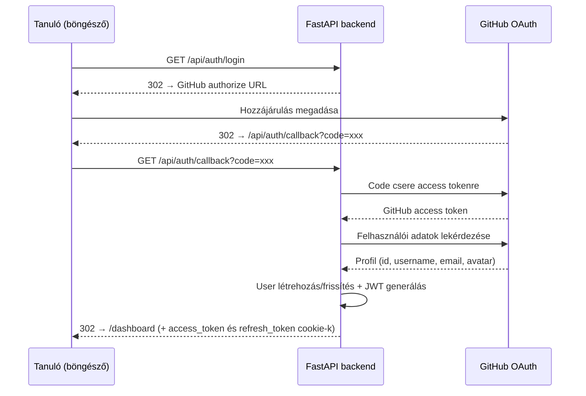
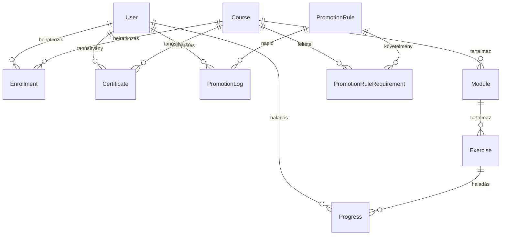
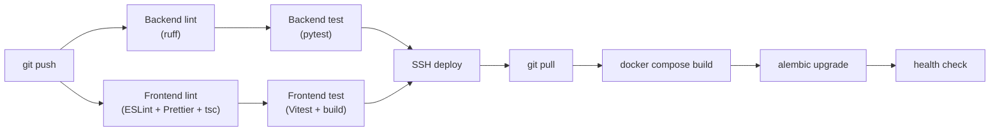

# Architektúra

Az OpenSchool egy oktatási platform, ahol a tanulók valódi fejlesztői munkafolyamatokon keresztül tanulnak programozni. A platform kurzusokat kezel, követi a haladást, GitHub-bal integrálódik az azonosításhoz és a CI-alapú értékeléshez, valamint hitelesíthető tanúsítványokat állít ki.

## Rendszer áttekintés



### Kérés útvonala

1. Minden forgalom az **nginx**-en keresztül érkezik a 80-as porton (vagy 443 SSL-lel)
2. Az `/api/*` és `/verify/*` kérések a **FastAPI backend**-re proxyződnak
3. Minden más kérés a React + Vite által épített **statikus fájlokat** szolgálja ki (SPA fallback-kel)
4. A backend a **PostgreSQL**-lel kommunikál az adattároláshoz
5. A backend a **GitHub API**-t hívja az OAuth-hoz és a CI állapot ellenőrzéshez

## Backend (FastAPI)

### Könyvtárstruktúra

```
backend/
├── app/
│   ├── main.py              # FastAPI alkalmazás, router regisztráció
│   ├── config.py             # Beállítások (pydantic-settings, .env olvasás)
│   ├── database.py           # SQLAlchemy engine, session, Base
│   ├── auth/
│   │   ├── jwt.py            # Token létrehozás és ellenőrzés (HS256)
│   │   └── dependencies.py   # get_current_user, require_role
│   ├── models/
│   │   ├── user.py           # User (github_id, role, stb.)
│   │   ├── course.py         # Course, Module, Exercise, Enrollment, Progress
│   │   ├── certificate.py    # Certificate (UUID, PDF útvonal)
│   │   └── promotion.py      # PromotionRule, PromotionRuleRequirement, PromotionLog
│   ├── routers/
│   │   ├── admin.py          # /api/admin/* — admin panel
│   │   ├── auth.py           # /api/auth/* — OAuth, bejelentkezés, profil
│   │   ├── certificates.py   # /api/me/certificates/*, /api/verify/*
│   │   ├── courses.py        # /api/courses/* — CRUD, beiratkozás, modulok
│   │   ├── dashboard.py      # /api/me/* — haladás, dashboard
│   │   └── webhooks.py       # /api/webhooks/* — GitHub webhook fogadás
│   └── services/
│       ├── certificate.py    # is_course_completed()
│       ├── discord.py        # Discord webhook értesítések
│       ├── discord_bot.py    # Discord Bot API — szerepkör szinkronizáció
│       ├── pdf.py            # PDF generálás fpdf2-vel
│       ├── promotion.py      # check_and_promote() — automatikus előléptetés
│       ├── qr.py             # QR kód generálás
│       ├── github.py         # GitHub Actions állapot lekérdezés
│       └── progress.py       # Haladás frissítés GitHub CI alapján
├── alembic/                  # Adatbázis migrációk
├── tests/                    # pytest tesztek
└── requirements.txt
```

### Azonosítási folyamat



### Szerepkör-alapú hozzáférés

| Szerepkör | Jogosultságok |
|-----------|---------------|
| `student` | Beiratkozás kurzusokra, haladás megtekintése, tanúsítvány igénylése |
| `mentor` | Minden, amit a student + tanulók haladásának megtekintése |
| `admin` | Minden + kurzusok/modulok/gyakorlatok CRUD, felhasználók kezelése, admin panel |

### Adatmodell



| Tábla | Kulcs mezők |
|-------|-------------|
| `users` | github_id, username, email, avatar_url, role, discord_id |
| `courses` | name, description |
| `modules` | course_id, name, order |
| `exercises` | module_id, name, repo_prefix, order, required, classroom_url |
| `enrollments` | user_id, course_id, enrolled_at |
| `progress` | user_id, exercise_id, status, github_repo |
| `certificates` | cert_id (UUID), user_id, course_id, issued_at, pdf_path |
| `promotion_rules` | name, description, target_role, is_active |
| `promotion_rule_requirements` | rule_id, course_id |
| `promotion_log` | user_id, rule_id, previous_role, new_role, promoted_at |

Részletes séma: [database.md](database.md)

## Frontend (React + TypeScript + Vite)

### Oldalak

| Útvonal | Azonosítás | Leírás |
|---------|------------|--------|
| `/` | Nem | Kezdőoldal — bemutató, kurzus előnézet |
| `/courses` | Nem | Kurzuslista |
| `/courses/:id` | Nem | Kurzus részletei modulokkal, beiratkozás |
| `/login` | Nem | GitHub OAuth bejelentkezés |
| `/dashboard` | Igen | Beiratkozott kurzusok, haladás, tanúsítványok |
| `/verify/[id]` | Nem | Nyilvános tanúsítvány hitelesítés |
| `/admin` | Igen (admin) | Admin dashboard — statisztikák |
| `/admin/users` | Igen (admin) | Felhasználók kezelése |
| `/admin/courses` | Igen (admin) | Kurzusok, modulok, gyakorlatok kezelése |

A Vite egyetlen HTML + JS/CSS bundle-t generál. Az nginx SPA fallback-kel szolgálja ki (`try_files $uri $uri/ /index.html`).

## Infrastruktúra

### Docker Compose szolgáltatások

| Szolgáltatás | Image | Cél |
|-------------|-------|-----|
| `backend` | Python 3.12 slim | FastAPI alkalmazás uvicorn-nal |
| `db` | PostgreSQL 16 | Adattárolás |
| `nginx` | nginx:alpine | Reverse proxy + statikus fájl kiszolgálás |
| `frontend` | Node 20 (csak build) | React + Vite build (SPA) |

### Éles vs. fejlesztői különbségek

| Szempont | Fejlesztés | Éles |
|----------|------------|------|
| Docker Compose fájl | `docker-compose.yml` | `docker-compose.prod.yml` |
| `ENVIRONMENT` | `development` | `production` |
| Swagger UI (`/docs`) | Elérhető | Kikapcsolt |
| uvicorn `--reload` | Igen | Nem |
| Backend/DB port | Kintről is elérhető | Csak belső |
| Health check | Nincs | 30s interval |
| Restart policy | Nincs | `always` |
| Log rotáció | Nincs | 10MB / 3 fájl |

### nginx útvonalak

```
/api/*      → proxy_pass http://backend:8000
/verify/*   → proxy_pass http://backend:8000/api/verify/
/health     → proxy_pass http://backend:8000
/*          → statikus fájlok (Vite build) SPA fallback-kel
```

## CI/CD



**CI** (minden push/PR, 4 párhuzamos job): backend lint → backend test, frontend lint → frontend test.

**CD** (push `main`-re, ha `VPS_HOST` be van állítva): SSH → git pull → docker compose build → alembic migrate → health check → Discord értesítés.

## Kulcs függőségek

| Csomag | Cél |
|--------|-----|
| `fastapi` | Web keretrendszer |
| `sqlalchemy` | ORM |
| `alembic` | Adatbázis migrációk |
| `pydantic-settings` | Konfiguráció .env-ből |
| `PyJWT` | JWT tokenek |
| `httpx` | HTTP kliens (GitHub API) |
| `fpdf2` | Tanúsítvány PDF generálás |
| `qrcode` | QR kód tanúsítványokhoz |
| `psycopg2-binary` | PostgreSQL driver |
| `slowapi` | Rate limiting |
| `pytest` | Tesztelés |
