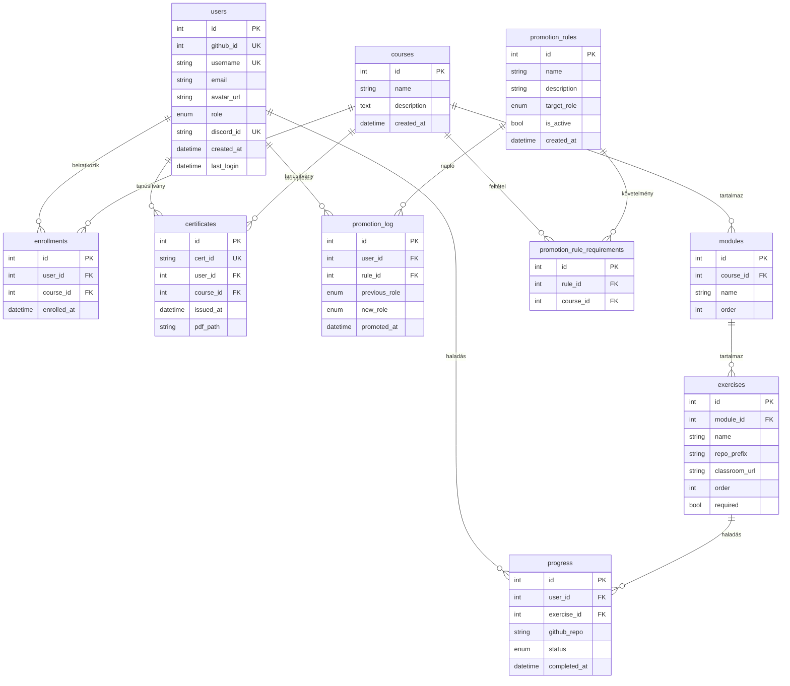

# Adatbázis séma

Az adatbázis SQLAlchemy ORM-mel van definiálva, Alembic migrációkkal kezelve. Fejlesztésben SQLite, élesben PostgreSQL 16.

## ER diagram



---

## Táblák

### `users`

GitHub OAuth-tal regisztrált felhasználók.

| Oszlop | Típus | Nullable | Default | Leírás |
|--------|-------|----------|---------|--------|
| `id` | Integer | — | autoincrement | PK |
| `github_id` | Integer | Nem | — | GitHub azonosító (unique) |
| `username` | String | Nem | — | GitHub felhasználónév (unique), bejelentkezéskor frissül |
| `email` | String | Igen | — | GitHub email (lehet null, ha privát) |
| `avatar_url` | String | Igen | — | Profilkép URL, bejelentkezéskor frissül |
| `role` | Enum | Nem | `student` | `student`, `mentor`, `admin` |
| `discord_id` | String | Igen | — | Discord snowflake (17-20 számjegy, unique) |
| `created_at` | DateTime | Igen | `now()` | Első bejelentkezés |
| `last_login` | DateTime | Igen | — | Utolsó bejelentkezés |

### `courses`

| Oszlop | Típus | Nullable | Default | Leírás |
|--------|-------|----------|---------|--------|
| `id` | Integer | — | autoincrement | PK |
| `name` | String | Nem | — | Kurzus neve |
| `description` | Text | Igen | — | Leírás |
| `created_at` | DateTime | Igen | `now()` | Létrehozás |

### `modules`

| Oszlop | Típus | Nullable | Default | Leírás |
|--------|-------|----------|---------|--------|
| `id` | Integer | — | autoincrement | PK |
| `course_id` | Integer (FK) | Nem | — | → `courses.id` |
| `name` | String | Nem | — | Modul neve |
| `order` | Integer | Igen | `0` | Megjelenítési sorrend |

### `exercises`

| Oszlop | Típus | Nullable | Default | Leírás |
|--------|-------|----------|---------|--------|
| `id` | Integer | — | autoincrement | PK |
| `module_id` | Integer (FK) | Nem | — | → `modules.id` |
| `name` | String | Nem | — | Feladat neve |
| `repo_prefix` | String | Igen | — | GitHub Classroom prefix. Tanulók repója: `{prefix}-{username}` |
| `classroom_url` | String | Igen | — | Classroom assignment link |
| `order` | Integer | Igen | `0` | Sorrend a modulon belül |
| `required` | Boolean | Nem | `true` | Szükséges-e a tanúsítványhoz |

### `enrollments`

| Oszlop | Típus | Nullable | Default | Leírás |
|--------|-------|----------|---------|--------|
| `id` | Integer | — | autoincrement | PK |
| `user_id` | Integer (FK) | Nem | — | → `users.id` |
| `course_id` | Integer (FK) | Nem | — | → `courses.id` |
| `enrolled_at` | DateTime | Igen | `now()` | Beiratkozás ideje |

Duplikáció-ellenőrzés kódban (`409` hiba), nem DB constraint.

### `progress`

| Oszlop | Típus | Nullable | Default | Leírás |
|--------|-------|----------|---------|--------|
| `id` | Integer | — | autoincrement | PK |
| `user_id` | Integer (FK) | Nem | — | → `users.id` |
| `exercise_id` | Integer (FK) | Nem | — | → `exercises.id` |
| `github_repo` | String | Igen | — | Repó neve (webhook tölti ki) |
| `status` | Enum | Nem | `not_started` | `not_started`, `in_progress`, `completed` |
| `completed_at` | DateTime | Igen | — | Csak `completed` esetén |

Frissítési források: manuális (`POST /api/me/.../progress`), webhook, sync-progress.

### `certificates`

| Oszlop | Típus | Nullable | Default | Leírás |
|--------|-------|----------|---------|--------|
| `id` | Integer | — | autoincrement | PK |
| `cert_id` | String | Nem | `uuid4()` | Publikus UUID, verifikációs URL-ben |
| `user_id` | Integer (FK) | Nem | — | → `users.id` |
| `course_id` | Integer (FK) | Nem | — | → `courses.id` |
| `issued_at` | DateTime | Igen | `now()` | Kiállítás ideje |
| `pdf_path` | String | Igen | — | `data/certificates/{cert_id}.pdf` |

Unique: `cert_id`, `(user_id, course_id)`.

### `promotion_rules`

| Oszlop | Típus | Nullable | Default | Leírás |
|--------|-------|----------|---------|--------|
| `id` | Integer | — | autoincrement | PK |
| `name` | String | Nem | — | Szabály neve |
| `description` | String | Igen | — | Leírás |
| `target_role` | Enum | Nem | — | `mentor` / `admin` |
| `is_active` | Boolean | Nem | `true` | Aktív-e |
| `created_at` | DateTime | Igen | `now()` | Létrehozás |

### `promotion_rule_requirements`

| Oszlop | Típus | Nullable | Default | Leírás |
|--------|-------|----------|---------|--------|
| `id` | Integer | — | autoincrement | PK |
| `rule_id` | Integer (FK) | Nem | — | → `promotion_rules.id` (CASCADE) |
| `course_id` | Integer (FK) | Nem | — | → `courses.id` |

Unique: `(rule_id, course_id)`. A szabály teljesül, ha a felhasználó minden felsorolt kurzushoz rendelkezik tanúsítvánnyal.

### `promotion_log`

| Oszlop | Típus | Nullable | Default | Leírás |
|--------|-------|----------|---------|--------|
| `id` | Integer | — | autoincrement | PK |
| `user_id` | Integer (FK) | Nem | — | → `users.id` |
| `rule_id` | Integer (FK) | Nem | — | → `promotion_rules.id` |
| `previous_role` | Enum | Nem | — | Korábbi szerepkör |
| `new_role` | Enum | Nem | — | Új szerepkör |
| `promoted_at` | DateTime | Igen | `now()` | Előléptetés ideje |

---

## Kapcsolatok

| Forrás | Cél | FK | Leírás |
|--------|-----|----|--------|
| `modules` | `courses` | `course_id` | Modul → kurzus |
| `exercises` | `modules` | `module_id` | Feladat → modul |
| `enrollments` | `users`, `courses` | `user_id`, `course_id` | Beiratkozás |
| `progress` | `users`, `exercises` | `user_id`, `exercise_id` | Haladás |
| `certificates` | `users`, `courses` | `user_id`, `course_id` | Tanúsítvány |
| `promotion_rule_requirements` | `promotion_rules`, `courses` | `rule_id`, `course_id` | Követelmény |
| `promotion_log` | `users`, `promotion_rules` | `user_id`, `rule_id` | Napló |

## Kaszkád törlés

`DELETE /api/admin/courses/{id}` — alkalmazás kódban, nem DB-szintű CASCADE:

```
Course → Module-ok → Exercise-ek → Progress rekordok
       → Enrollment-ek
       → Certificate-ek
```

## Alembic migrációk

```bash
make migrate                                  # alembic upgrade head
cd backend && alembic revision --autogenerate -m "leírás"   # új migráció
alembic downgrade -1                          # visszagörgetés
```

| Migráció | Leírás |
|----------|--------|
| `5492c9d27e5f` | `users` tábla |
| `38fa8a895630` | `courses`, `modules`, `exercises`, `enrollments`, `progress` |
| `a1b2c3d4e5f6` | `github_token` (deprecated) + `classroom_url` |
| `cefa39428d67` | `certificates` + `required` oszlop |
| `d1e2f3a4b5c6` | `promotion_rules`, `promotion_rule_requirements`, `promotion_log` |
| `e2f3a4b5c6d7` | `discord_id` (`users`, unique) |
